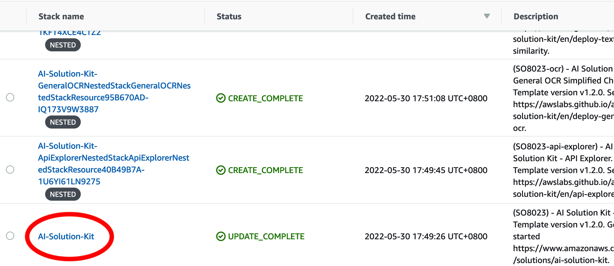

## API test
You can use the following tools (API explorer, Postman, cURL, Python, Java) to test calling APIs.
### API Explorer

**Prerequisites**

When [deploying the solution](deployment.md), you need to：

- set the parameter **API Explorer** to `yes`.
- set the parameter **API Gateway Authorization** to `NONE`.

Otherwise, you can only view the API definitions in the API explorer, but cannot test calling API online. 

**Steps**

1. Sign in to the [Amazon CloudFormation console](https://console.aws.amazon.com/cloudformation/).
2. On the **Stacks** page, select the solution’s root stack. Do not select the NESTED stack.
    
    

3. Choose the **Outputs** tab, and find the URL for APIExplorer.
4. Click the URL to access the API explorer. The APIs that you have selected during deployment will be displayed. 

    

5. For the API you want to test, click the down arrow to display the request method.
6. Choose the **Try it out** button, and enter the correct Body data to test API and check the test result.
7. Make sure the format is correct, and choose **Execute**.
8. Check the returned result in JSON format in the **Responses body**. If needed, copy or download the result.
9. Check the **Response headers**.
10. (Optional) Choose **Clear** next to the **Execute** button to clear the request body and responses. 

### Postman (*AWS_IAM* Authentication）

1. Sign in to the [Amazon CloudFormation console](https://console.aws.amazon.com/cloudformation/).
2. On the **Stacks** page, select the solution’s root stack.
3. Choose the **Outputs** tab, and find the URL with the prefix `GeneralOCR`.
4. Create a new tab in Postman. Paste the URL into the address bar, and select *POST* as the HTTP call method.

    

5. Open the Authorization configuration, select Amazon Web Service Signature from the drop-down list, and enter the AccessKey, SecretKey and Amazon Web Service Region of the corresponding account (such as cn-north-1 or cn-northwest-1 ).

    

6. Open the Body configuration item and select the raw and JSON data types. 
7. Enter the test data in the Body, and click the **Send** button to see the corresponding return results.

``` json
{
  "url": "{{page.meta.sample_image}}"
}
```


### cURL

* Windows
``` bash
curl --location --request POST "https://[API_ID].execute-api.[AWS_REGION].amazonaws.com/[STAGE]/{{page.meta.feature_endpoint}}" ^
--header "Content-Type: application/json" ^
--data-raw "{\"url\": \"{{page.meta.sample_image}}\"}"
```

* Linux/MacOS
``` bash
curl --location --request POST 'https://[API_ID].execute-api.[AWS_REGION].amazonaws.com/[STAGE]/{{page.meta.feature_endpoint}}' \
--header 'Content-Type: application/json' \
--data-raw '{
  "url":"{{page.meta.sample_image}}"
}'
```

### Python (*AWS_IAM* Authentication)

``` python
import requests
import json
from aws_requests_auth.boto_utils import BotoAWSRequestsAuth

auth = BotoAWSRequestsAuth(aws_host='[API_ID].execute-api.[AWS_REGION].amazonaws.com',
                           aws_region='[AWS_REGION]',
                           aws_service='execute-api')

url = 'https://[API_ID].execute-api.[AWS_REGION].amazonaws.com/[STAGE]/{{page.meta.feature_endpoint}}'
payload = {
    'url': '{{page.meta.sample_image}}'
}
response = requests.request("POST", url, data=json.dumps(payload), auth=auth)
print(json.loads(response.text))
```

### Python (*NONE* Authentication)

``` python
import requests
import json

url = "https://[API_ID].execute-api.[AWS_REGION].amazonaws.com/[STAGE]/{{page.meta.feature_endpoint}}"

payload = json.dumps({
  "url": "{{page.meta.sample_image}}"
})
headers = {
  'Content-Type': 'application/json'
}

response = requests.request("POST", url, headers=headers, data=payload)

print(response.text)
```

### Java

``` java
OkHttpClient client = new OkHttpClient().newBuilder()
  .build();
MediaType mediaType = MediaType.parse("application/json");
RequestBody body = RequestBody.create(mediaType, "{\n  \"url\":\"{{page.meta.sample_image}}\"\n}");
Request request = new Request.Builder()
  .url("https://xxxxxxxxxxx.execute-api.xxxxxxxxx.amazonaws.com/[STAGE]/{{page.meta.feature_endpoint}}")
  .method("POST", body)
  .addHeader("Content-Type", "application/json")
  .build();
Response response = client.newCall(request).execute();
```
