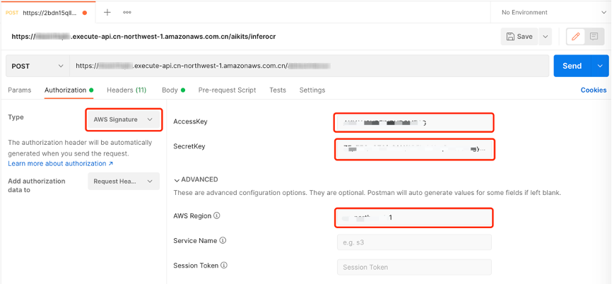

###  Example Codes

**cURL**
``` bash
curl --location --request POST 'https://[API_ID].execute-api.[AWS_REGION].amazonaws.com/[STAGE]/{{page.meta.feature_endpoint}}' \
--header 'Content-Type: application/json' \
--data-raw '{
  "url":"{{page.meta.sample_image}}"
}'
```

**Python** （*AWS_IAM* Authentication）
``` python
import requests
import json
from aws_requests_auth.boto_utils import BotoAWSRequestsAuth

auth = BotoAWSRequestsAuth(aws_host='[API_ID].execute-api.[AWS_REGION].amazonaws.com',
                           aws_region='[AWS_REGION]',
                           aws_service='execute-api')

url = 'https://[API_ID].execute-api.[AWS_REGION].amazonaws.com/[STAGE]/{{page.meta.feature_endpoint}}'
payload = {
    'url': '{{page.meta.sample_image}}'
}
response = requests.request("POST", url, data=json.dumps(payload), auth=auth)
print(json.loads(response.text))
```

**Python** （*NONE* Authentication）
``` python
import requests
import json

url = "https://[API_ID].execute-api.[AWS_REGION].amazonaws.com/[STAGE]/{{page.meta.feature_endpoint}}"

payload = json.dumps({
  "url": "{{page.meta.sample_image}}"
})
headers = {
  'Content-Type': 'application/json'
}

response = requests.request("POST", url, headers=headers, data=payload)

print(response.text)
```

**Java**
``` java
OkHttpClient client = new OkHttpClient().newBuilder()
  .build();
MediaType mediaType = MediaType.parse("application/json");
RequestBody body = RequestBody.create(mediaType, "{\n  \"url\":\"{{page.meta.sample_image}}\"\n}");
Request request = new Request.Builder()
  .url("https://xxxxxxxxxxx.execute-api.xxxxxxxxx.amazonaws.com/[STAGE]/{{page.meta.feature_endpoint}}")
  .method("POST", body)
  .addHeader("Content-Type", "application/json")
  .build();
Response response = client.newCall(request).execute();
```

### Request URL as AWS_IAM in Postman

When deploying the solution, if the **APIGatewayAuthorization** parameter is set to *AWS_IAM*, [IAM] will be used automatically (https://docs.aws.amazon.com/en_us/apigateway/latest/developerguide/permissions.html) Permissions control access to the API. After the scenario deployment is complete, you will see a URL prefixed with **{{ page.meta.feature_id }}** in the Outputs tab of Amazon CloudFormation. Create a new tab in Postman, paste the URL into the address bar, and select *POST* as the HTTP call method.


Open the Authorization configuration, select Amazon Web Service Signature in the drop-down list, and fill in the AccessKey, SecretKey and Amazon Web Service Region of the corresponding account (such as cn-north-1 or cn-northwest-1 ).



Open the Body configuration item and select the raw and JSON data types. Enter the test data in the Body, and click the Send button to see the corresponding return results.

``` json
{
  "url": "{{page.meta.sample_image}}"
}
```

